# VS Code : Markdown Viewer 설치
 - Market Place
 - `bierner.markdown-mermaid` 검색 후 설치
 
# NVM

> window : https://github.com/coreybutler/nvm-windows

> mac : curl -o- https://raw.githubusercontent.com/nvm-sh/nvm/v0.39.1/install.sh | bash

# NodeJs( `v16+` ), yarn(`1.22.4`), Craco(`5.9.0`)

>`sudo nvm install node-verion`

>`nvm ls` > 설치된 node 목록

>`nvm use node-version`


# ENV

- dev   : ./env/pbp/dev/..
- stage : ./env/pbp/stage/..
- prod  : ./env/pbp/prod/..

# run

>`npm run dev` | `yarn dev`

>`npm run stage` | `yarn stage`

>`npm run prod` | `yarn prod`

# Build

> dev
- `yarn build:dev:pbp:oled`
- `yarn build:dev:pbp:tone-free`
- `yarn build:dev:pbp:refrigerator`

> stage
- `yarn build:stage:pbp:oled`
- `yarn build:stage:pbp:tone-free`
- `yarn build:stage:pbp:refrigerator`

> prod
- `yarn build:prod:pbp:oled`
- `yarn build:prod:pbp:tone-free`
- `yarn build:prod:pbp:refrigerator`

> result
- dist/(`dev` or `stage` or `prod`)/static/js
- dist/(`dev` or `stage` or `prod`)/static/css

> index.jsp
```html
<!-- react style -->
<link href="/uk/tvs/lg-oled65zx9la/pbp/static/css/main.cfec7331.chunk.css" rel="stylesheet">
<!-- //react style -->
```
> main.`cfec7331`.chunk.css <-- build (dist/(dev or stage or prod)/static/css) 파일으로 변경

```html
<script src="/uk/tvs/lg-oled65c24la/pbp/static/js/2.af615f8f.chunk.js"></script>
<script src="/uk/tvs/lg-oled65c24la/pbp/static/js/main.7228c12b.chunk.js"></script>
```
> /2.`af615f8f`.chunk.js, main.`7228c12b`.chunk.js 각 파일명을 build(dist/(dev or stage or prod)/static/js) 파일명으로 변경

```html
<!-- 
    #PBP Contents 
    attribues
    - MODE 		: API HOST ( DEV, STATE, PROD )
    - PGCODE 	: PBP/TV, PBP/REF, PBP/TFREE
    - LOCODE	: UK 고정
    - LOG		: LOG 출력 여부
-->
<section class="react-content-wrap">
    <div  
        id="root" 
        class="react-container-wrap"
        MODE="STAGE" 
        PGCODE="<c:out value='${param.pgCode}'/>" 
        PDCODE="<c:out value='${param.pdCode}'/>" 
        LOCODE="UK"
        LOG="true">
    </div>
</section>
<!-- // PBP Contents -->
```
> MODE 변경 > 운영 배포시 MODE="`PROD`"

- TV : /uk/tvs/lg-oled65c24la/pbp?mode=`stage`&pgCode=`PBP/TV`
- REF : /uk/tvs/lg-oled65c24la/pbp?mode=`stage`&pgCode=`PBP/REF`
- TREE : /uk/tvs/lg-oled65c24la/pbp?mode=`stage`&pgCode=`PBP/TFREE`

> 페이지 진입시 특정 상품으로 선택처리 ( `PDCODE` )

- ex : /uk/tvs/lg-oled65c24la/pbp?mode=`stage`&pgCode=`PBP/TV`&PDCODE=`( Model Id )`
---
# Common

## Provider

| Path |
| ---- |
| src/components/common/provider/provider.tsx |

`L:SliderState`
> Slider State
```typescript
let SliderState: any = {
    count:0,
};
```

`C:slideAction`
> slide Action Event Trigger
```typescript
const slideAction: any ={
    SLIDE_CHANGE    : '$$_SLIDE_CHANGE_$$',
    SLIDE_END       : '$$_SLIDE_END_$$',
    SLIDE_START     : '$$_SLIDE_START_$$',
    DRAG_START      : '$$_DRAG_START_$$',
    DRAG_END        : '$$_DRAG_END_$$'
}
```


`SliderContext, SlideReduce`
> Slider Context, Reduce
```typescript
const
    SliderContext = createContext(SliderState),
    SlideReduce=( state:any, action:any ) => {
        switch( action.type ) {
            default:
                SliderState = { ...SliderState, ...action.state }
                return { ...SliderState }
        }    
    }
```

## Slider

| Name | Path |
| ---- | ---  |
| Slider | src/components/common/slider/slider.tsx |
| Easing | src/components/common/slider/easing.tsx |

### Interface

| Properties | Type | Essential | Info |
| ---- | ---- | ---- | ---- |
| children | Elements | `Y` | 목록 |
| limit | Boolean | N | 이동 제한 적용 여부 ( 양끝기준 )
| onClick | Function | N | 내부 클릭 이벤트 |
| event | Function | N |슬라이드 이벤트 |
| index | Number | N | 초기 선택(focus) index |
| infinity | Boolean | N | 무한 슬라이드 적용 여부 |
| arrow | Boolean | N | 좌,우 화살표 사용 여부 |
| setControl | Function | N | 내부 컨트롤 함수를 받을경우 실행시 컨트롤러를 리턴 받을 함수를 등록 |
| limitNoCount | Boolean | N | 우측 이동시 limit 상태일때는 SlideIndex 변경 하지 않음 여부 |
| duration | Number | N | 슬라이드 animation duration |
| easing | String | N | 애니메이션 easing type |

```typescript
export default function Slider( { 
        children, 
        limit = true, 
        onClick = ()=>{}, 
        event = ()=>{},
        index = 0,
        infinity = false,
        arrow = true,
        setControl=()=>{},
        limitNoCount = false,
        duration=600,
        easing="easeOutCubic"
    }:
    {   children: any;
        limit?: boolean; 
        onClick?: Function; 
        event?: any;
        index?: number; 
        infinity?: boolean;
        setControl?: Function; 
        arrow?: boolean;
        limitNoCount?: boolean;
        duration?: number; 
        easing?:string;
    })
    ...
```
`C: states`
```typescript
// window > width, height ( resie시 마다 업데이트)
[ resize, setResize ] = useState<any>({}),
// drag 여부
[ isDrag, setDrag ] = useState(false),
// 무한 슬라이드 조건 활성화 여부
[ infiniteSlide, setInfiniteSlide ] = useState(false),
// 화살표 버튼 활성, 비활성
[ arState, setArState ] = useState<any>({
    first: false,
    last: false
}),
// 드래그 최소 반응 값
reactionSize: number = 20,
// 드래그 영역(대상)
container:any = useRef(null),
// 목록 컨테이너
list: any = useRef(null),
// 초기화 타이머
finishTimer: any = useRef(null),
// 슬라이드 index
sCount: any = useRef(0),
// drag 상태 값
drag: any = useRef({});
```

`C:actionEventName`
> eventListeners
```typescript
const actionEventName: Array<string> = [  
    'touchstart',
    'touchmove',
    'touchend',
    'touchleave',
    'touchcancel',
    'mousedown',
    'mousemove',
    'mouseup',
    'mouseleave'
]
```

`F:getItemWidth`
> 하위 엘리먼트 넓이값을 합해 총 값을 반환
```typescript
const getItemWidth=()=>{
    let val: any = 0;
    if( container?.current && list?.current && list?.current.children?.length ) val = list?.current.children[0].offsetWidth;
    return val;
}
```

`F:slideEvent`
> Slide Index가 변경될 때 마다, 등록된 Event를 통해 변경값을 전달
```typescript
const slideEvent=useCallback( (action: any )=>{
    let 
        max: number = list.current.children?.length,
        index: number = action?.index < 0 ? ( max + action?.index ) : ( action?.index%max );
    
    event({
        type: action?.type,
        index: index,
    });
}, [event]);
```

`F:dragEnd`
> 드래그 종료
```typescript
const dragEnd=useCallback( ()=>{
```
> slide 이후 position 초기화 체크 ( 무한 슬라이드 적용일 경우 )
```typescript
    slideFinish();
```
> Drag 상태가 아닐경우 종료
```typescript
    if( !drag.current.draging ) {
        return;
    }
```
> 최소 이동값 충족시 이동값에 따른 대상 자동 선택, 최소 이동값 미 충족시 원위치
```typescript
    if( container.current ) { 
        // 최소 이동값 충족 여부 확인 및 이동 처리
        if( Math.abs( drag.current.movePoint ) > reactionSize ) {
            dragAfterAction();
        }
        /**
         * @description
         * - 최소 이동값 미충족시 원위치로 이동
         */ 
        else {
            dragSelected( sCount.current );
        }
    }
```
> 초기화
```typescript
    // 초기화
    drag.current = {};
    // eslint-disable-next-line
},[ infiniteSlide ]);
```

`F:controller`
> 좌,우 버튼(arrow) 액션
```typescript
const controller=useCallback(( type: string )=>{
    if( finishTimer.current ) return;
    switch( type ) {
    ...
```
> Next
```typescript
        case slideTrigger.SLIDER_TRIGGER_NEXT:
            drag.current.movePoint = 500;
            drag.current.draging = true;
            dragEnd();
        break;
```
> Prev
```typescript
        case slideTrigger.SLIDER_TRIGGER_PREV:
            drag.current.movePoint = -500;
            drag.current.draging = true;
            dragEnd();
        break;
```
> Reset
```typescript
        case slideTrigger.SLIDER_TRIGGER_RESET:
            dragSelected(0);
        break;
```
> `movePoint`값은 최소 이동값(`reactionSize`) 이상으로 -,+ 설정시 해당 방향으로 이동 처리 된다.

```typescript
    }
    // eslint-disable-next-line
},[infinity,infiniteSlide]);
```

`F:actionEvent`
> touch event ( mobile )
```typescript
const actionEvent=useCallback( async( e: any )=> {
    document.body.setAttribute("ondragstart","return false");
    document.body.setAttribute("onselectstart","return false");
    if( finishTimer.current ) return;

    const 
        touchProps = e.changedTouches?.[0],
        touchX = touchProps?.clientX || 0;

    switch( e.type ) {
```
> body에 드래그 및 셀렉트 이벤트를 막음
- document.body.setAttribute("ondragstart","return false");
- document.body.setAttribute("onselectstart","return false");
---
> touch event 발생시, darg 초기값을 설정
```typescript
        /**
         * @DragStart
         * @description
         * - down offset point
         */
        case "touchstart":
            if( !drag.current.dragStart ) { 
                if(e.cancelable) e.stopPropagation();
                drag.current.dragStart = true;
                drag.current.startPoint = touchX;

                const 
                    style: any = getElementStyle(),
                    matrix: any = new WebKitCSSMatrix( style.transform ),
                    itemWidth = getItemWidth();
                
                drag.current.offsetPoint = matrix.m41;
                drag.current.itemWidth = itemWidth;
            }
        break;
```
- dragStart     : 드래그 준비 상태
- startPoint    : touch 시작 위치
- offsetPoint   : 드래그 컨테이너위 현재 위치
- itemWidth     : 하위 목록의 전체 넓이
---
> drag시 최소 +,- 10이상은 이동을 해야 drag 모드가 활성화 된다.

> drag모드시 하위 element의 click Event는 무시된다.
```typescript
        /**
         * @Drag
         * @description
         * - down drag
         */
        case "touchmove":
            if(e.cancelable) e.preventDefault();
            if( drag.current.dragStart ) { 
                drag.current.movePoint = Math.ceil( drag.current.startPoint - touchX );
                drag.current.moveX = drag.current.offsetPoint - drag.current.movePoint;
                if( Math.abs( drag.current.movePoint ) > 10 ) {
                    drag.current.draging = true;
                    if( !isDrag ) {
                        await setDrag( true );
                    }
                }
                dragMove( drag.current.moveX );
            }
        break;
```
- movePoint     : 드래그 이동 값
- moveX         : 드래그 컨테이너에 실제 적용될 이동 값 
- draging       : 드래그 모드 적용 여부
---
> drag 모드가 아닐경우 초기 위치로 이동, drag 모드시 `dragEnd`함수를 실행
```typescript
        /**
         * @DragEnd
         * @description
         * - 
         */
        case "touchend":
        case "touchleave":
            if( drag.current.draging ) {
                dragEnd();
            } else {
                dragSelected( sCount?.current );
            }
        break;
    }
```

```typescript
    // eslint-disable-next-line
},[isDrag,infiniteSlide,setDrag]);
```

`F:dragAfterAction`
```typescript
const dragAfterAction=useCallback( ()=>{
    ...
```
> 무한 슬라이드 조건이 아닐경우 limit 적용
```typescript
    if(!infiniteSlide) { 
        const limit: number = list?.current.children.length-1;
        let slideIndex: number = drag.current.movePoint > 0 ? sCount.current+1 : sCount.current-1;
        if( slideIndex < 0 ) slideIndex = 0;
        if( slideIndex > limit ) slideIndex = limit;
```

> `slideIndex`에 변경 사항이 있을경우 `slideEvent(외부)`실행, 변경사항이 없을경우 기존 위치 처리
```typescript
        if( slideIndex !== sCount.current ) {
            slideEvent({ 
                type: slideAction.SLIDE_CHANGE,
                index: slideIndex
            });
            dragSelected( slideIndex );
        } else {
            dragSelected( sCount.current );
        }
    }
```
> 무한 슬라이드일경우 `limit제한 없이 slideIndex를 변경` 하고, `슬라이드 처리 후` 실행되는 `fakePos`함수에서 컨테이너 위치를 `fake처리`
```typescript
    /**
     * @TODO Infinity
     * @description
     * - 
     */
    else {
        let slideIndex: number = drag.current.movePoint > 0 ? sCount.current+1 : sCount.current-1;
        slideEvent({ 
            type: slideAction.SLIDE_CHANGE,
            index: slideIndex
        });
        dragSelected( slideIndex );
    }
```
```typescript
    // eslint-disable-next-line
},[infiniteSlide,slideEvent]);
```

`F:fakePos`
> 하위 목록(childElements)가 없을경우 종료
```typescript
const fakePos=useCallback( ()=>{
    if( !list?.current?.children ) return;
```
> slideIndex가 '-'일경우 Copy된 목록의 마지막 Element에 위치하고 있음으로 real Element위 위치로 변경 (animation미적용)
```typescript
    const max = list?.current?.children?.length;
    if( sCount.current < 0 ) {
        dragSelected( max-1, false );
    }
```
> slideIndex가 목록의 length보다 높을경우 Copy된 목록의 첫번째 Element에 위치하고 있음으로 real Element위 위치로 변경 (animation미적용)
```typescript
    if( sCount.current > max-1 ) {
        dragSelected( 0, false );
    }
```
```typescript
    // eslint-disable-next-line
},[]);
```

`F:setArrowState`
> 무한 슬라이드가 아닐경우 좌,우 화살표 버튼의 활성화 여부 변경
```typescript
const setArrowState=useCallback(( state: any )=>{
    if( !infinity || limitNoCount ) {
        setArState( (p:any)=>( { ...p, ...state }));
    }
},[limitNoCount,infinity,setArState]);
```

`F:getArrowState`
> 무한 슬라이드가 아닐경우 좌,후 화살표 버튼의 활성화 값 반환
```typescript
const getArrowstate=useCallback(( str: string )=>{
    return ( !infinity  || limitNoCount ) ? arState?.[str] : false;
},[infinity,limitNoCount,arState]);
```

`F:eventListener`
> touch 이벤트 등록 및 삭제
```typescript
const eventListener=useCallback( ( add: boolean )=>{
    if( getTarget()?.parentElement ) {
        actionEventName.map( event => getTarget()?.parentElement[ add ? 'addEventListener' : 'removeEventListener']( event, actionEvent ) )
    }
    // eslint-disable-next-line
},[isDrag,actionEvent])
```

`slider example code`
```typescript
const config = {
    limit: true,
    index: 0,
    infinity: true,
    arrow: true,
    duration: 500,
    easing: 'easeInOutExpo' // <- src/components/common/slider/easing.tsx
}
...

<Slider { ...config }>
    { [1,2,3,4,5,6,7,8,8,9,10].map( (n:any)=><div>{ n }</div> ) }
</Slider>
```
---
#### Easing

| Type | Value |
| ---- | ---- |
| easeInExpo | cubic-bezier(0.950, 0.050, 0.795, 0.035) |
| easeOutExpo | cubic-bezier(0.190, 1.000, 0.220, 1.000) |
| easeInOutExpo | cubic-bezier(1, 0, 0, 1) |
| easeOutCubic | cubic-bezier(0.215, 0.610, 0.355, 1.000) |
| easeInQuart | cubic-bezier(0.895, 0.030, 0.685, 0.220) |
| easeOutQuart | cubic-bezier(0.165, 0.840, 0.440, 1.000) |
| easeInOutQuart | cubic-bezier(0.77, 0, 0.175, 1) |
| easeInQunut | cubic-bezier(0.755, 0.050, 0.855, 0.060) |
| easeOutQuint | cubic-bezier(0.230, 1.000, 0.320, 1.000) |
| easeInOutQuint | cubic-bezier(0.860, 0.000, 0.070, 1.000) |
| easeInCirc | cubic-bezier(0.600, 0.040, 0.980, 0.335) |
| easeOutCirc | cubic-bezier(0.075, 0.820, 0.165, 1.000) |
| easeInOutCirc | cubic-bezier(0.785, 0.135, 0.150, 0.860) |
| easeInBack | cubic-bezier(0.600, 0, 0.735, 0.045) |
| easeOutBack | cubic-bezier(0.175, 0.885, 0.32, 1.275) |
| customBack | cubic-bezier(.16,1,.19,1.19) |
| easeInOutBack | cubic-bezier(0.68, -0.55, 0.265, 1.55) |
| easeInSine | cubic-bezier(0.47, 0, 0.745, 0.715) |
| easeOutSine | cubic-bezier(0.39, 0.575, 0.565, 1) |
| easeInOutSine | cubic-bezier(0.445, 0.05, 0.55, 0.95) |
| easeOutElastic | cubic-bezier(.75,-0.5,0,1.75) |
| default | cubic-bezier(0.1, 0.57, 0.1, 1)
---

## Modal

### BASE

| Name | Path |
| ---- | ---- |
| ModalContainer | src/components/common/modal/modal.tsx |
| ModalViewContainer | src/components/common/modal/modal-view-container.tsx |
| ModalComponent | src/components/common/modal/modal-component.tsx |

`ModalContainer`
```typescript
const { state } = useContext( ModalContext );

return (
    <div className={ 'react-modal-wrap' }>
        { 
            !!state?.modals?.length && ( state?.modals.map( (item: any, c: any) => <ModalComponent key={c} item={item}/> ) )
        }
    </div>
)
```
> Reducer > state에 등록된 Modal 생성

`ModalViewContainer`
> Modal Type에 설정된 컴포넌트와 Props를 반환
```typescript
const ModalViewContainer=( { item = {}, close=()=>{} }:{ item: any, close: Function } )=>{
    const getComponent=useCallback(()=>{
        const currentItem = item?.item;
        switch( item?.type ) {
            ... 모달 타입별 조건 처리
```
> `ex : AR360`
```typescript
            case modalType.IMG360:
                return { 
                    btnCss: 'react-modal-gallery-btn-close',
                    rootClass: '',
                    Component: Image360Container,
                    props: { 
                        url: currentItem?.preview360
                    }
                }
```
```typescript
const render: any = getComponent();
```
`Render`
```typescript
<div className={`react-modal-gallery-wrap ${render.rootClass}`}>
    <button onClick={()=>close()} className={render?.btnCss}></button>
    <render.Component { ...render.props }/>
</div>
```

### TEMPLATE

| Name | Path |
| ---- | ---- |
| VideoContainer | src/components/common/modal/template/`video`/video-container.tsx |
| ImageContainer | src/components/common/modal/`image`/image-container.tsx |
| Image360Container | src/components/common/modal/`image`/image360.tsx |
| CarError | src/components/common/modal/`cart`/cart-error.tsx |
| CartComplete | src/components/common/modal/`cart`/cart-complete.tsx |
| ReStockContainer | src/components/common/modal/`re-stock`/re-stock-container.tsx |
| ReStockComplate | src/components/common/modal/`re-stock`/re-stock-complate.tsx |
| ReStockError | src/components/common/modal/`re-stock`/re-stock-error.tsx |
| ReStockFoot | src/components/common/modal/`re-stock`/re-stock-foot.tsx |
| ReStockForm | src/components/common/modal/`re-stock`/re-stock-form.tsx |
| ReStockHeader | src/components/common/modal/`re-stock`/re-stock-header.tsx |
| ReStockNotification | src/components/common/modal/`re-stock`/re-stock-notification.tsx |

### Reducer, Provider, Context

| Path |
| ---- |
| src/reduces/modal/modal-reduce.tsx |

`C:modalAction`
> Modal Action List
```typescript
const modalAction: any = {
    MODAL_OPEN          : '$$_MODAL_OPEN__$$',
    MODAL_CLOSE         : '$$_MODAL_CLOSE__$$',
}
```

`C:modalType`
> Modal Type List
```typescript
const modalType: any = {
    GALLERY             : '$$_MODAL/GALLERY_$$',
    VIDEO               : '$$_MODAL/VIDEO_$$',
    IMG360              : '$$_MODAL/IMG360_$$',
    RESTOCK             : '$$_MODAL/RESTOCK_$$',
    RESTOCK_COMPLETE    : '$$_MODAL/RESTOCK/COMPLETE_$$',
    RESTOCK_ERROR       : '$$_MODAL/RESTOCK/ERROR_$$',
    RESTOCK_DUPLICATE   : '$$_MODAL/RESTOCK/DUPLICATE_$$',
    CART_COMPLETE       : '$$_MODAL/CART/COMPLETE_$$'
}
```

`S:modalState`
> Modal List(STATE), 화면에 생성된 Modal 정보는 배열(modalState>modals)에 등록되어 관리
```typescript
const modalState: any = {
    modals: []
};
```

`R:modalReduce` 
- Modal Open
```typescript
const modalReduce=( state:any = modalState, action:any = {} )=>{
    ...
```
> `GNB(z-index:1000)`영역 위로 뜨도록 react 영역의 `z-index(1001)`변경
```typescript
    case modalAction.MODAL_OPEN:
        rootElement.style.position = 'relative';
        rootElement.style.zIndex= '10001'; 
```
> Modal 생성시, 고유 ID(`MODEL_ID`)를 랜덤생성
```typescript 
        if( !action.option?.MODEL_ID ) {
            action.option.MODEL_ID = randomString();
        }
```
> Modal Type 지정
```typescript
        if( !action?.option?.MODAL_TYPE ) {
            action.option.MODAL_TYPE = modalType.GALLERY
        }
```
> reducer > state에 Modal 정보를 등록
```typescript
        state.modals.push( action.option );
        return { ...state };
    ...
```

- Modal Close
```typescript
case modalAction.MODAL_CLOSE:
```
>생성시 만든 고유 ID로 삭제될 팝업 정보 추출
```typescript
    if( action?.MODEL_ID && state.modals?.length ) { 
        let target = state.modals.find( (item:any) => item?.MODEL_ID === action?.MODEL_ID );
```
> await상태인 팝업은 resolve 처리
```typescript
        if( target?.resolve ) {
            target.resolve();
        }
```
> 삭제 대상 팝업을 목록에서 제외
```typescript
        state.modals = state.modals.filter( (item:any) => item?.MODEL_ID !== action?.MODEL_ID );
```
> Modal의 고유 ID가 없는 경우, 목록에 마지막 팝업을 제거
```typescript
    } else {
        let target = state.modals[ state.modals?.length-1 ];
        if( target?.resolve ) {
            target.resolve();
        }
        state.modals.splice( state.modals?.length-1, 1 );
    }
```
> 팝업이 모두 닫힌 경우, React영역 z-index 초기화
```typescript
    if(!state.modals?.length) {
        rootElement.style.position = '';
        rootElement.style.zIndex= '';
    }
    return { ...state };
```
```typescript
}
```

`ModalProvider`
```typescript
const ModalProvider = ( { children }: { children: React.ReactNode } )=>{
```
> Reducer
```typescript
    const [ state, dispatchWithMiddleware ] = ModalMiddleWare( useReducer( modalReduce, modalState ), [MiddleWare], [AfterWare] );
```
> Context Props
```typescript
    const getState=useCallback(()=>({
        state: {...state},
        dispatch: dispatchWithMiddleware
    })
    // eslint-disable-next-line
    ,[state]);
```
> Render
```typescript
    return (
        <ModalContext.Provider value={ getState() }>
            { !!children && children }
        </ModalContext.Provider>
    )
}
```

`modal open example code`
> modal 생성 샘플코드 ( `ex: 상품 재입고 알림 신청` )
```typescript
import { useModal } from "@lge/hooks/use-modal";
// Modal Hook에서 생성할 Modal 함수를 가져온다.
const { modelReStock } = useModal();
// Modal 생성
modalReStock( item?.modelId );
```
---
# Reduces

| Name | Path |
| ---- | ---- |
| PBP Reduce, Context, Middleware | src/reduces/pbp/pbp-reduce.tsx |
| UI Reduce, Context, Middleware | src/reduces/ui/ui-reduce.tsx |
| Model Reduce, Context, Middleware | src/reduces/modal/modal-reduce.tsx |

- PBP Reduce, Context, Middleware

`S:PBPStates`

```typescript
let PBPStates: any = {
    DATA: {},
    CURRENT_TYPE: '',
    CURRENT_MODEL:'',
    GALLERY: {
        INDEX: 0
    },
    MODELS: {}
```
- DATA : PBP API 데이터
- CURRENT_TYPE : 모델 타입 ( 티비, 냉장고, 톤프리 )
- CURRENT_MODEL : 선택 모델
- GALLERY : 선택된 gallery Index
- MODELS : config.json > PRODUCT_CONFIG
---

`C:PBPType`
> reduce action type
```typescript
const PBPType: any = {
    DATA            : '$$__ACTION_DATA__$$',
    SELECT_MODEL    : '$$__ACTION_MODEL_SELECT__$$',
    GALLERY_INDEX   : '$$__ACTION_GALLERY_INDEX__$$',
}
```
- DATA : 데이터 변경시
- SELECT_MODEL : 모델 변경시
- GALLERY_INDEX : 갤러리 변경시
---

`C:PBPContext`
> Context
```typescript
const PBPContext = createContext(PBPStates);
```

`F:Reducer`
```typescript
const PBPReduce = ( state: any = PBPStates, action: any  ) => {
    switch( action?.type ) {
```
> config.json 로드 완료 후 Reducer STATE > MODELS에 등록
```typescript
        /**
         * @TODO apply product config
         */
        case PBPType.SETUP:
            return {
                ...state,
                MODELS: action?.PRODUCT_CONFIG
            }
```
> config.json에 Model, bundle 정보로 API호출 후 결과 데이터를 reducer STATE > DATA에 등록
```typescript
        /**
         * @TODO DATA UPDATE
         * @description
         * -
         */
        case PBPType.DATA:
            return { 
                ...state, 
                DATA:action.data, 
                CURRENT_TYPE: action.productType,
                CURRENT_MODEL: APP_CONFIG.option.PDCODE ? APP_CONFIG.option.PDCODE : action.data?.productList[0]?.modelId
            };
```
> 모델 변경 정보 업데이트
```typescript      
        /**
         * @TODO MODEL SELECT
         * @description
         * - 
         */
        case PBPType.SELECT_MODEL:
            return { 
                ...state, 
                CURRENT_MODEL: action.model, 
                //상품 변경시 gallery index 초기화
                GALLERY: { INDEX: 0 } 
            };
```
> 갤러리 변경 정보 업데이트 
```typescript        
        /**
         * @TODO GALLERY SELECT INDEX
         * @description
         * -
         */
        case PBPType.GALLERY_INDEX:
            return { 
                ...state, 
                GALLERY: { INDEX: action.index } 
            };
```
```typescript    
        default:
            return { ...state };
    }
}
```

`PBPProvider`
> MiddleWare, Reducer 등록
```typescript
const PBPProvider=( { children }: { children: React.ReactNode } )=>{
    const [ state = 0, dispatchWithMiddleware ] = PBPStoreMiddleWare( useReducer( PBPReduce, PBPStates), [storeMiddleWare], [storeAfterWare] );
```
> Provider, Child Render 
```typescript
    return (
        <PBPContext.Provider value={{state, dispatch:dispatchWithMiddleware }}>
            { children ? children : '' }
        </PBPContext.Provider>
    )
}
```

- UI Reduce, Context, Middleware

`C:uiState`
```typescript
const uiState: any = {
    loading: true,
    mobile: false,
    scroll: {},
};
```
- loading : 로딩 활성, 비활성
- mobile : mobile 여부
- scroll : scroll 정보 ( `window.scroll.top` )
---

`F:uiReduce`
```typescript
const uiReduce=( state:any = uiState, action:any = {} )=>{
    switch( action.type ) {
```
> 로딩 상태 변경
```typescript
        case uiAction.LOADING:
            state.loading = action.loading;
            return { ...state };
```
> 모바일 상태 변경
```typescript
        case uiAction.MOBILE:
            state.mobile = action.mobile;
            return { ...state };
```
> 스크롤 정보 업데이트 
```typescript
        case uiAction.SCROLL:
            state.scroll = {
                ...state.scroll,
                top: action.scroll?.top,
                move: action.scroll?.top < state?.scroll?.top ? 'up' : 'down'
            }
            return { ...state };
```
```typescript
        default:
            return { ...state };
    }
}
```

`C:UIContext`
```typescript
const UIContext = createContext(`uiState`);
```

```typescript
const UIProvider = ( { children }: { children: React.ReactNode } )=>{
```
> Middleware, Reducer
```typescript
    const [ state, dispatchWithMiddleware ] = UIMiddleWare( useReducer( uiReduce, uiState ), [MiddleWare], [AfterWare] );
```
> Props
```typescript
    const getState=useCallback(()=>({
        state: {...state},
        dispatch: dispatchWithMiddleware
    }),
    // eslint-disable-next-line
    [state]);
```
> Provider, Child Render
```typescript
    return (
        <UIContext.Provider value={ getState() }>
            { !!children && children }
        </UIContext.Provider>
    )
}
```

- MiddleWare ( PBP, UI, Modal 동일 )
```typescript
const MiddleWare=( reduce:any, middlewareFns: any, afterwareFns: any ) => {
```
> <b>Reducer, STATE</b>

> aRef (useRef) 함수내에서 일반 변수 사용시 참조 및 변경을 하기 위해선 useCallBack을 사용해야 하지만, 사용하지 않고 useRef를사용하여 바로 참조 및 변경 처리
```typescript
    const 
        [ state = 0, dispatch] = reduce,
        aRef = useRef('');
```
> <b>MiddleWare</b>: Reducer를 통해 변경되는 사항들은 이곳을 통해 업데이트
```typescript
    const dispatchWithMiddleware=( action:any )=>{
        aRef.current = action;
        middlewareFns.forEach((middlewareFn:any) => middlewareFn({ state, action } ));
        dispatch(action);
    };
```
> <b>AfterWare</b>: Reducer의 변경 이후 상태값을 이곳(`afterwareFn`)을 통해 확인 한다.
```typescript
    useEffect(() => {
        afterwareFns.forEach( (afterwareFn:any)=>afterwareFn({ state, action: aRef.current }) );
        aRef.current = '';
        // eslint-disable-next-line react-hooks/exhaustive-deps
    }, [afterwareFns]);
```
```typescript
    return [state, dispatchWithMiddleware];
};
```
---

# Hooks

| Name | Path |
| ---- | ---- |
| API | src/hooks/use-api.tsx |

- getConfig     : 설정 데이터 로드 ( config.json )
- setCart       : 장바구니에 등록
- getCartId     : 장바구니 초기화, 장바구니 ID
- getData       : PBP 데이터
- reStock       : 재입고 알림 신청 ( returnCode > `00`:완료, `01`:중복, `99`:에러 )?

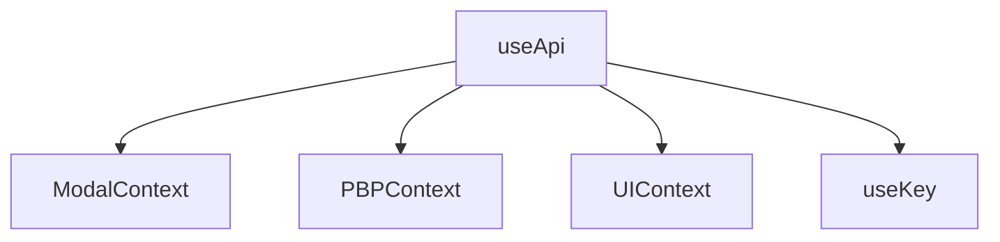

| Name | Path |
| ---- | ---- |
| MODAL | src/hooks/use-modal.tsx |

- modalReStock              : 재입고 알림신청
- modalReStockError         : 재입고 알림신청 에러
- modalReStockDuplicate     : 재입고 알림신청 중복
- modalReStockComplete      : 재입고 알림신청 완료
- cartComplete              : 장바구니 등록 완료
- cartError                 : 장바구니 등록 에러

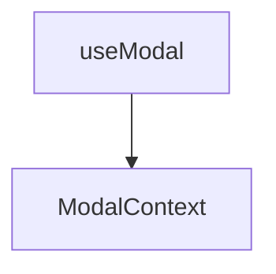

| Name | Path |
| ---- | ---- |
| REISZE | src/hooks/use-resize.tsx |

- size          : { width, height } > `window innerOffset` 

| Name | Path |
| ---- | ---- |
| SCROLL | src/hooks/use-scroll-event.tsx |

- scroll        : window props
- eScroll       : target props > `ex : const { eScroll } = useScrollEvent( target Element )`

| Name | Path |
| ---- | ---- |
| STATE FILTER | src/hooks/useKey.tsx |

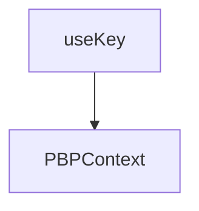

`dataProp`
```typescript
const dataProp: any = {
    PRODUCT : '$$__STORE_PRODUCT__$$', 
    BUNDLE  : '$$__STORE_BUNDLE__$$',
    GALLEY  : '$$__STORE_GALLEY__$$',
    MODELS  : '$$__STORE_MODELS__$$'
}
```

- PRODUCT       : 제품 목록
- BUNDLE        : 추천 상품 목록
- GALLEY        : 선택된 상품의 갤러리 목록
- MODELS        : 모델 목록

`useKey`
```typescript
const useKey=()=>{
    const 
        { state } = useContext( PBPContext ),
        getProps=( key:any )=>{
            const 
                result: any = state?.DATA || {},
                config: any = state?.MODELS || {};

            let data;
            switch( key ) {
                ...
```

> Type별 데이터 반환
```typescript
    case dataProp.BUNDLE:
        data = result?.bundleList;
    break;
    case dataProp.PRODUCT:
        data = result?.productList;
    break;
    case dataProp.GALLEY:
        data = getCurrentItem( result );
    break;
    case dataProp.MODELS:
        data = config;
    break;
```

| Name | Path |
| ---- | ---- |
| STATE | src/hooks/usePBPStore.tsx |

- state         : reduce state
- getStates     : reduce state ( `useCallback` )
- dispatch      : reduce eventDispatch
- update        : reduce eventDispatch ( `useCallBack` )

> 내역 업데이트 확인이 안되는 항목에만 `useCallback( getStates, update )` 적용된 함수를 사용
---
# Libs

## Libs
| Name | Path |
| ---- | ---- |
| STATE | src/libs/blis.tsx |

- scrollCounting    : start, limit값 기준의 scroll count 반환
- setStyle          : 대상 엘리먼트에 style 적용
- thousandComma     : 천 단위 콤마 적용 ( 소수점 무시 )
- currency          : 천 단위 콤마 적용 ( 소수점 적용 )
- check360View      : 360View 적용 여부
- checkVrView       : Vr 적용 여부
- is360             : 360View, Vr 적용 여부 확인 후 적용
- setVideo          : 비디오 적용
- getModelItem      : modelId로 해당 모델 데이터 반환 `ex : const curData: any = getModelItem( items, modelId )`
- printPrice        : 가격 반환(할인가 있을시 적용) `price + priceCent`
- uppserCase        : 대상에 대문자 적용
- soldOut           : out of stock 여부
- vipFlag           : vip 여부
- instFlag          : 할부 여부
- getDomain         : 도메인 반환 ( `dev, state, prod -> environment.tsx 참조` )
- PDFDownLoad       : PDF Download 링크 적용
- appendScript      : script > header에 동적 추가
- randomString      : 랜덤 문자열 반환
- checkEmail        : 이메일 유효성 체크
- disableLog        : console.log 영역 미출력 처리
- getImageDomain    : 이미지 Url에 도메인 적용 ( `local dev only` )
- PDF               : 다운로드 여부 ( `product sheet, uk, ue` )

## Tokken

| Name | Path |
| ---- | ---- |
| STATE | src/libs/storage/tokken.tsx |

- getTokken     : ACCESS_TOKEN 반환
- setTokken     : ACCESS_TOKEN 등록

> sessionStage에 등록된 tokken 반환

## Http

| Name | Path |
| ---- | ---- |
| STATE | src/libs/http/http.tsx |

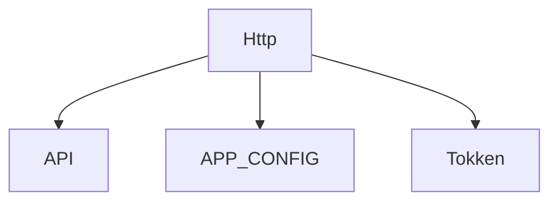

`F:apUrl`
> APP_CONFIG.option?.MODE( dev, stage, prod )별 도메인 적용
```typescript
const apUrl=( key:string = '' )=>{ 
    const
        domain: any = getDomain(), 
        api: string = API?.[(APP_CONFIG.option?.MODE).toLowerCase()]?.[key];
```
> Local TEST가 아닐경우 도메인 적용 후 반환
```typescript
    return (
        (APP_CONFIG.option?.MODE).toUpperCase() !== 'TEST' ?
        ( api.indexOf("http") !== -1 ? api : (domain + api) ) : api
    )
}
```

`Interceptor`
```typescript
fetchIntercept.register({
```
- request
> 도메인 포함 API URL 생성
```typescript
    request: function async (url, config) {
        let apiURL: string = url;
```

> 국가코드 적용( `Default: UK` )
```typescript    
        /**
         * #HOST
         * @description
         * - 국가코드 적용
         */
        if( apiURL.indexOf('main.chunk') === -1 ) {
            if( 
                apiURL.indexOf('/uk/') !== -1 && 
                APP_CONFIG.option.LOCODE && 
                APP_CONFIG.option.LOCODE !== 'uk' 
            ) {
                apiURL = apiURL.replace( '/uk/', `/${(APP_CONFIG.option.LOCODE).toLowerCase()}/`);
            }
```
> Parameter Object to queryString
```typescript
            /**
             * #QueryString
             * @description
             * - get only
             */
            if( 
                (config.method).toUpperCase() === "GET" && 
                config?.params 
            ) {
                let queryString = Object.entries(config?.params).map(e => e.join('=')).join('&');
                apiURL+='?'+queryString;
            }
        }
        return [apiURL, config];
    },
```
- requestError
```typescript
    requestError: function (error) {
        //window.reactConsole.log('fetch>requestErrors',error)
        return Promise.reject(error);
    },
```
- response
```typescript
    response: function (response) {
        //window.reactConsole.log('fetch>response',response)
        return response;
    },
```
- responseError
```typescript
    responseError: function (error) {
        //window.reactConsole.log('fetch>responseError',error)
        return Promise.reject(error);
    }
});
```

`requestInitConfig`
> Default Request Header
```typescript
const requestInitConfig=()=>{
    const config: any = {
            method: "GET",
            headers: {
                Authorization: `Bearer ${getTokken()}`,
                'Content-Type': 'application/json',
                Store: (APP_CONFIG.option.LOCODE).toLowerCase()
            }
    };
```
> Local Test
```typescript
    if( (APP_CONFIG.option.MODE||"").toUpperCase() === 'TEST' ) {
        config.mode = 'no-cors';
        config.credentials = 'include';
        config.headers = {
            ...config.headers,
            'Access-Control-Allow-Credentials': true,
            'Access-Control-Allow-Origin': "*",
            'Access-Control-Allow-Methods': 'GET, POST, DELETE, HEAD, OPTIONS'
        };
    }
    return config;
};
```

`Http (fetch)`

```typescript
const Http=async( requestInfo: any = {}, params: any = {} )=>{
    const url: string = apUrl( requestInfo?.url );
    ...
        switch( (reqInit?.method).toUpperCase() ) {
```
> POST
```typescript
            /**
             * #POST
             * @description
             * - 
             */
            case "POST":
                reqInit.body = typeof params === "object" ? JSON.stringify(params || {} ) : params;
            break;
```
> FORM 
- `method가 Form`일경우 헤더 `Content-Type`을 `application/x-www-form-urlencoded`로 변경
```typescript
            /**
             * #POST FORM-DATA
             * @description
             * - 
             */
            case "FORM":
                reqInit.method = "POST";
                reqInit.headers['Content-Type'] = 'application/x-www-form-urlencoded';
                reqInit.body = Object.keys(params||{}).map(key => key + '=' + params[key]).join('&');
            break;
```
> GET : Default
```typescript
            /**
             * #GET
             * @description
             * - 
             */
            default:
                if( params ) {
                    reqInit.params = params;
                    reqInit.body = null;
                }
        }
```
> Fetch
```typescript
        const res: any = await fetch( requestInfo.url, reqInit )
            .then( (res:any) => res.json())
            .catch( (e:any)=>{
                window.reactConsole.log('[Http-Error]', e?.message );
            }) || {};
            
        return res;
    }
```
> Api Map ( `src/config/api/api.tsx` )에 매칭값이 없는경우
```typescript
    else {
        window.reactConsole.log('Url is Not Found');
        return Promise.resolve(null);
    }
}
```
---

# Environment

## build:pbp
 
`DEV`

| Path |
| ---- |
| env/pbp/`dev`/.env |
| env/pbp/`dev`/oled.env |
| env/pbp/`dev`/refrigerator.env |
| env/pbp/`dev`/tone-free.env |

```env
BUILD_PATH=dist/dev
PUBLIC_URL=/lg5-common-gp
...
```

`STAGE`

| Path |
| ---- |
| env/pbp/`stage`/.env |
| env/pbp/`stage`/oled.env |
| env/pbp/`stage`/refrigerator.env |
| env/pbp/`stage`/tone-free.env |

```env
BUILD_PATH=dist/stage
PUBLIC_URL=/uk/tvs/lg-oled65c24la/pbp
...
```

`PROD`

| Path |
| ---- |
| env/pbp/`prod`/.env |
| env/pbp/`prod`/oled.env |
| env/pbp/`prod`/refrigerator.env |
| env/pbp/`prod`/tone-free.env |

```env
BUILD_PATH=dist/prod
PUBLIC_URL=/uk/tvs/lg-oled65c24la/pbp
...
```

## HOST, PROTOCAL

| Name | Path |
| ---- | ---- |
| Environment | src/environment.tsx |

`API_HOST`
```typescript
export const API_HOST: any = {
    TEST    : 'localhost',
    DEV     : 'wdev50.lg.com',
    PROD    : 'wwww.lg.com',
    STAGE   : 'wwwstg.lg.com'
}
```
`API_PROTOCAL`
```typescript
export const API_PROTOCAL: any = {
    TEST    : 'http',
    DEV     : 'https',
    PROD    : 'https',
    STAGE   : 'https'
}
```

# Config

| Name | Path |
| ---- | ---- |
| APP CONFIG | src/config/const/config.tsx |
| API CONFIG | src/config/api/api.tsx |
| SLIDER CONFIG | src/config/const/slider-const.tsx |
| BUTTON CONFIG | src/config/const/button-const.tsx |

## API 

`apiType`
> Api Type
```typescript
const apiType: any = {
    CONFIG          : "APP/PRODUCT/CONFIG",
    PBP_DETAIL      : "API/PBP/DETAIL",
    ENERGY_LABLES   : 'API/OUTSIDE/ENERGY_LABELS',
    ADD_CART        : 'API/SET/CART',
    LOGIN           : 'API/GET/LOGIN',
    LOGIN_FALL      : 'API/GET/LOGIN/FALL',
    RESTOCK         : 'API/SET/RESTOCK',
}
```

- CONFIG            : 설정 ( `config.json` )
- PBP_DETAIL        : PBP 데이터
- ENERGY_LABLES     : 에너지 레이블 
- ADD_CART          : 장바구니
- LOGIN             : 로그인 ( local test )
- LOGIN_FALL        : 로그인 실패 ( local test )
- RESTOCK           : 재입고 알림 신청


`API`

- prod              : 운영
- stage             : 스테이지
- dev               : 개발
- test              : local test

> Api 목록 설정은 1개만 사용해도 무방( test를 위해 분리 ), `mode(dev,state,prod)`에 따라 도메인 설정은 `environment.tsx`설정값으로 적용 된다.

> `CONFIG만 페이지 경로 기준`
```typescript
[apiType?.CONFIG]: `${process.env.PUBLIC_URL}/assets/json/config.json`,
[apiType?.PBP_DETAIL]: `/uk/mkt/ajax/product/retrieveProductSummarys`,
[apiType?.ENERGY_LABLES]: `https://api.youreko.com/v1/en-gb/lg/energy-labels.js`,
[apiType?.ADD_CART]: `/uk/shop/graphql`,
[apiType?.LOGIN]: '',
[apiType?.RESTOCK]: `/uk/mkt/ajax/reStockNotification/createReStockEmail`,
```
> `domain`이 붙지 않는 API들은 `environment.tsx`에 설정값을 적용

## APP CONFIG

- CONFIG_PGCODE
- APP_CONFIG(`static`) > option

`CONFIG_PGCODE`
```typescript
export const CONFIG_PGCODE: any = {
    PBP_TV    : 'PBP/TV',
    PBP_REF   : 'PBP/REF',
    PBP_TFREE : 'PBP/TFREE'
}
```
- PBP_TV        : 티비
- PBP_REF       : 냉장고
- PBP_TFREE     : 이어폰

`APP_CONFIG` ( option : React > root Element Attribute )
```typescript
export namespace APP_CONFIG {
    /**
     * @PGCODE 
     *  - PBP ( CONFIG_PGCODE ) > PBP/TV, PBP/REF, PBP/TFREE
     */
    export const option: any = { 
        MODE    : '', // MODE
        PGCODE  : '', // PAGE 구분
        PDCODE  : '', // 모델 번호 ( 상품코드 )
        LOCODE  : '', // 국가코드
        LOG     : true
    };
}
```

> HTML TAG 속성에 값 지정시 적용 ( `index.jsp` )
```html
<section class="react-content-wrap">
    <div  
        id="root" 
        class="react-container-wrap"
        MODE="STAGE" 
        PGCODE="<c:out value='${param.pgCode}'/>" 
        PDCODE="<c:out value='${param.pdCode}'/>" 
        LOCODE="UK"
        LOG="true">
    </div>
</section>
```

# Components

| Name | Path |
| ---- | ---- |
| App | src/app.tsx |
| PBP | src/components/PBP/PBP.tsx |
| Sticky | src/components/PBP/sticky/sticky.tsx |
| `RecommList` | src/components/PBP/recomm/recomm-list.tsx |
| - `RecommList Provider` | `src/components/PBP/recomm/provider/recomm-context.tsx` |
| BtnStock | src/components/PBP/recomm/item/btn-stock.tsx |
| BtnCart | src/components/PBP/recomm/item/btn-cart.tsx |
| ItemContainer | src/components/PBP/recomm/item/item-container.tsx |
| Item | src/components/PBP/recomm/item/item.tsx |
| PriceContainer | src/components/PBP/recomm/item/price-container.tsx |
| Price | src/components/PBP/recomm/item/price.tsx |
| Stock | src/components/PBP/recomm/item/stock.tsx |
| PreviewContainer | src/components/PBP/preview/preview-container.tsx |
| ImageSmall | src/components/PBP/preview/small/image-small.tsx |
| ImageLarge | src/components/PBP/preview/large/image-large.tsx |
| ProductInfo | src/components/PBP/info/product-info.tsx |
| Buy | src/components/PBP/info/buy/buy.tsx |
| ButtonContainer | src/components/PBP/info/choose/button-container.tsx |
| ChooseColor | src/components/PBP/info/choose/choose-color.tsx |
| ChooseSize | src/components/PBP/info/choose/choose-size.tsx |
| SelectButton | src/components/PBP/info/choose/select-button.tsx |
| DownloadContainer | src/components/PBP/info/detail/download/download-container.tsx |
| SavingContainer | src/components/PBP/info/detail/saving/saving-container.tsx |
| SavingContent | src/components/PBP/info/detail/saving/saving-content.tsx |
| SavingFooter | src/components/PBP/info/detail/saving/saving-footer.tsx |
| SavingTop | src/components/PBP/info/detail/saving/saving-top.tsx |
| DetailContainer | src/components/PBP/info/detail/detail-container.tsx |
| ModelInfo | src/components/PBP/info/detail/model-info.tsx |
| ProductPrice | src/components/PBP/info/detail/product-price.tsx |

`Component Structure`
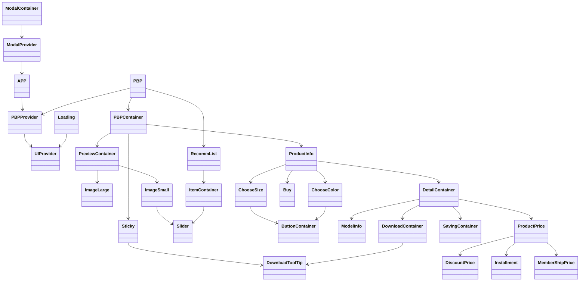

# Component Diagram 

## INDEX 
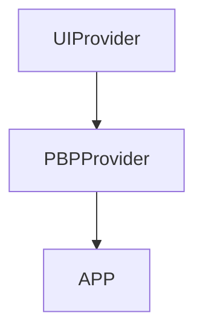
---
## APP
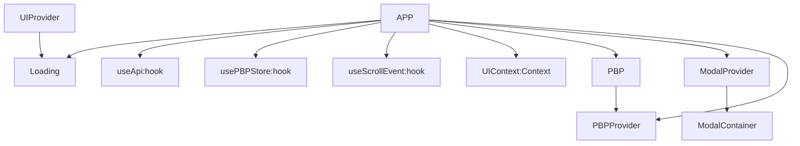
---
## PBP
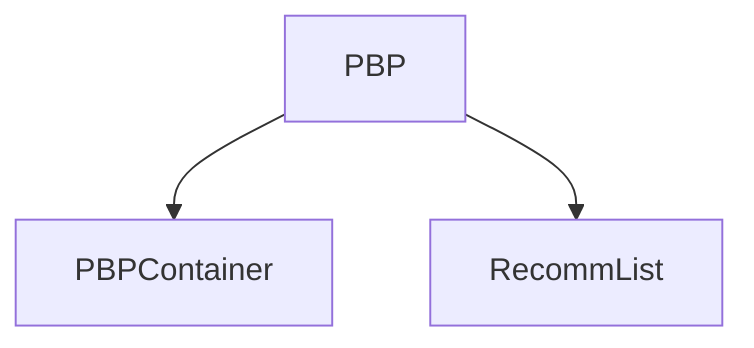
---
## PBPContainer
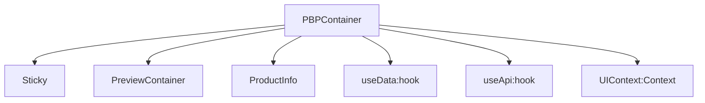
---
## Sticty
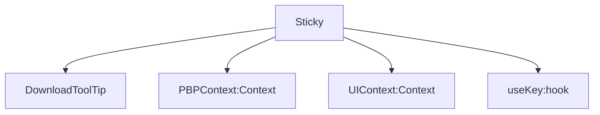
---
## PreviewContainer
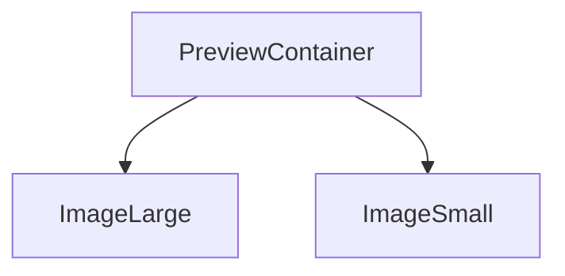
---
## ProductInfo
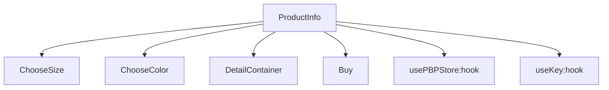
---
## DetailContainer
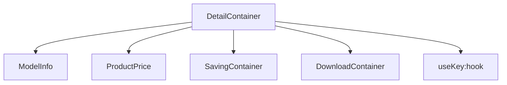
---
## ProductPrice 
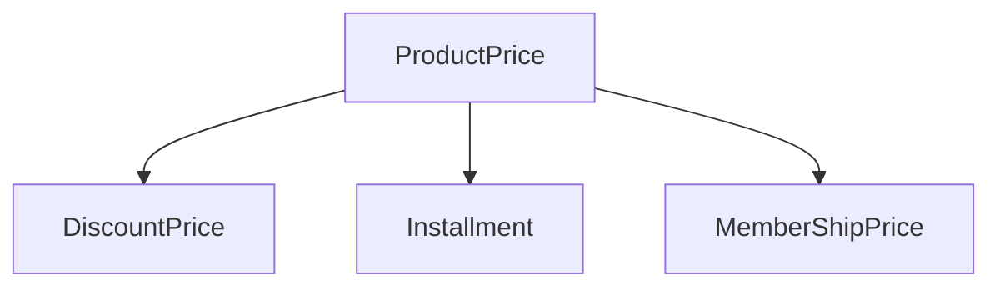
---
## ImageSmall
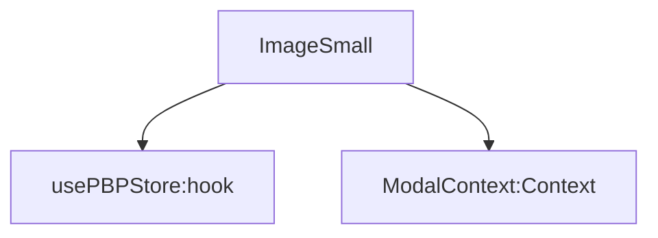
